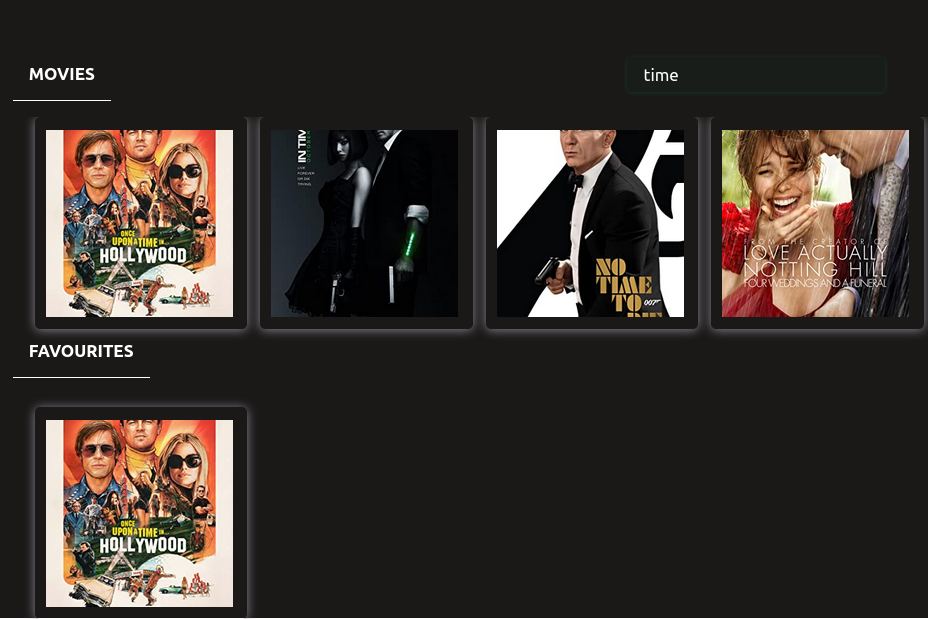
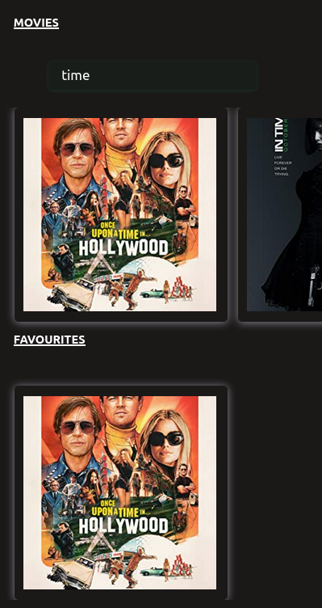

# Movie Application

Sideland : **## Movie Application**

> ### Overview :

- movie-application are a good instance project to use cards slider.
  it is one of the most popular project that refers to website where you can buy
  or watch movie online, like Netflix,justwatch.tubitv and many others. I think is one
  those project to start as a beginners in react. It is a friendly opening project.

## Interest

You might want to spot how to use:

- -useState Hook one of the most used state of react using destructuring syntax of javascript
  like example:
  const[favourites, setFavourites] = useState([])

- -useEffect Hook used for updating additional codes REACT-DOM everytime some change apply to a specific variable or group of
  set variables is passed in a second parameter as **array** (ex: [], [data], [data, searchValue], ...)

### Links

- Solution URL: [https://github.com/BeinRain06/movies-application.git](https://github.com/BeinRain06/movies-application.git)
- Live Site URL: [https://beinrain06.github.io/movies-application/](https://beinrain06.github.io/movies-application/)

## Description : \* challenge issue

- i faced difficulty in useEffect Hook because inside callBack function of UseEffect() i used **return** forbidden
- i at the same level had difficulty first to pass entire components as <FavouriteToAdd/> and <FavouriteToRemove/> inside <MovieBox/> component. I finally figure out that i have to pass these components as simple props and at the final stage zhere the components will be used to redefined them as components : <FavouriteComponent/>

## CSS Structures:

> - <App/> Component , three main containers :
>
> -App_header
> -App_intermediary_header
> -movies_container

**Picture**

---

---

# What I learned

### React Hook Enhanced

**_useState Hook_** one of the most used state of react using destructuring syntax of javascript
_like example_: const[favourites, setFavourites] = useState([]);
_ favourites : is a variable
_ setFavourites : function to change the above variable (favourites)
_ [] : empty array - initial state value of _ favourites \*

>

**_useEffect Hook_** used for updating additional codes REACT-DOM everytime some change apply to a specific variable or group of set variables is passed in a second parameter as `array` (ex: [], [data], [data, searchValue], ...)

- _sample_ : useEffect(Callback function, [state])

* **example**: useEffect(() => {fetchMovies(searchValue)}, [searchValue]);

  > tip : don't use any **return** inside the useEffect Hook

> fetchMovies(searchvalue) : function fecthMovies with argument -searchvalue
> [searchValue] : var _searchValue_ that makes re-render of REACT-DOM whenvever its change.

### javaScript Enhanced

- **map()** method javascript returns a new Array with value passed as argument when looping at an array

  > e.g: const myMovies = movies.map((movie) => {

                     return (
                       <MovieCart key={movie.imdbID} movie={movie}/>
                     )
                   });

- **filter()** method javascript returns a nez array with value that meet conditions returned inside
  > e.g: const newFavourite = favourites.filter((favourite) => favourite.imdbID !== movie.imdbID );

### utilities Materials:

    -Materials icons [https://mui.com/material-ui/material-icons/](https://mui.com/material-ui/material-icons/)

### Mobile Responsiveness

    - Mobile reponsiveness for mobile max-width: 475px ,max-width: 715px,

**Picture**

---

---

## Callback History:

- Age of Internet. The industry of movies has grown in a new look with the release of devices
  able to treat and render beautiful images. With people so capable on digitalization and the interconnection of the
  world with internet the lead of movies online website becomes a trend for the marketing of movies.
  Before we remember we have to have walk on the street and bumps into a movie trailer, or watch
  a commercials ads at TV, read news articles, magazine ads to be glad to discover our upcoming preffered movies.
  Now you could buy, watch movies online via your mobile phone computer and so others without a need of a TV,
  or going back when dreaming where so capable to see the walk at the cinema and in the shadow room holding to one epic
  scene in the film tells your partner that you have been in love for him/her funny right.
  So Good!

**1975**. _The kodal Digital Cameram first digital Camera invented
by Steven Sasson recorded
black and white image on a cassette tape..._

## Useful Resources :

kevin Powell : [video: 'create a horizontal media scroller with css' ] : was my base to achieve my horizontal media scroller with just css

Copycat : ['https://www.copycat.dev/blog/react-localstorage/'] : helps me make my localstorage item persist in my website app

LogRocket: ['https://blog.logrocket.com/create-carousel-react-slick/#:~:text=React%20Slick%20is%20a%20great,some%20%of20%its%20main%20features'] >
allows me to understand how to implement react-slick for achieving card sliders in react-app
but didn't work for my case due to issue inport _css Slick-Carousel_
Sufa Digital : Udemy course in react -movie-app

## Acknowledge:

This project always remember the Team :

-Kevin Powell: with his easy explanation of properties of css

-Sufa Digital: with his light how to achieve our project

-CopyCat Team: with a slight articlr article that unlock key of localStorage in Our Project...

## Author

- Frontend Mentor - [https://www.frontendmentor.io/profile/BeinRain06](https://www.frontendmentor.io/profile/BeinRain06)
- Twitter - [https://twitter.com/nest_Ngoueni](https://twitter.com/nest_Ngoueni)
